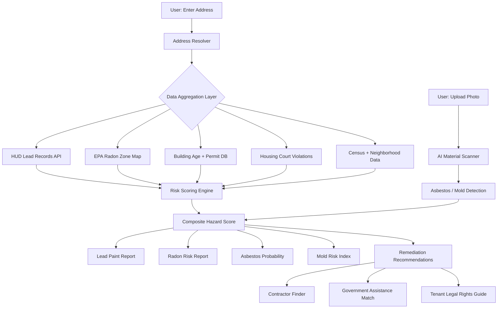

<p align="center">
  <h1 align="center">foundation-safe-home</h1>
  <h3 align="center"><em>Environmental hazard detection. Lead, asbestos, radon, mold. Risk-score any address.</em></h3>
</p>

<p align="center">
  <a href="LICENSE"></a>
  
  
  <a href="https://mama.oliwoods.ai"></a>
  <a href="https://mama.oliwoods.ai/foundation"></a>
</p>

---

> **"No level of lead exposure is safe for children. Even low levels cause permanent IQ loss, behavioral disorders, and reduced lifetime earnings."**
> — World Health Organization, 2023
>
> *Half a million U.S. children under 5 have elevated blood lead levels. Most live in homes that passed inspection.*

## Why This Exists

- **Lead is everywhere and invisible.** 37 million U.S. homes — 30% of the housing stock — contain lead-based paint. Pre-1978 homes are not required to disclose lead hazards in most rental agreements ([HUD, 2021](https://www.hud.gov/program_offices/healthy_homes))
- **Asbestos kills 40,000 Americans annually.** Mesothelioma and asbestos-related lung disease cause more U.S. deaths each year than highway accidents, yet asbestos remains legal in building materials in the U.S. ([EPA, 2023](https://www.epa.gov/asbestos))
- **Radon is the #2 cause of lung cancer.** 21,000 Americans die from radon-induced lung cancer each year. Nearly 1 in 15 homes has radon levels at or above the EPA action level — and most homeowners have never tested ([EPA Radon Guide](https://www.epa.gov/radon))
- **Mold costs are hidden.** Indoor mold costs the U.S. an estimated $3.7 billion annually in healthcare and remediation, disproportionately affecting renters who cannot demand repairs ([NIEHS, 2022](https://www.niehs.nih.gov/))

## What Safe Home Does

| Capability | Description |
|---|---|
| **Address Risk Score** | Aggregate hazard score for any U.S. address using age, census data, inspection records, and violation history |
| **Lead Paint Predictor** | Year-built + renovation history model that estimates lead paint probability by room type |
| **Radon Zone Lookup** | EPA zone mapping + soil type analysis + local test result aggregates |
| **Asbestos Material Scanner** | Photo-based AI identification of suspected asbestos-containing materials |
| **Mold Probability Model** | Humidity + ventilation + water intrusion history risk scoring |
| **Violation History** | Aggregated housing court, code enforcement, and EPA records by address |
| **Remediation Finder** | Certified contractors, government assistance programs, and tenant legal rights by ZIP |
| **Renter Alert System** | Automated notification when new violations are filed at a monitored address |

## System Architecture



## Why This Is the Best Tool on the Market

Housing inspection is gated behind expensive private tests ($200–$800 per hazard), real estate disclosure loopholes, and landlord-controlled access. Low-income renters — who disproportionately live in older housing stock — have no way to independently assess risk.

**We built this so any renter or parent can type an address and get a full hazard picture in under 60 seconds.**

### vs. Commercial Alternatives

| Feature | foundation-safe-home | Commercial Alt. |
|---------|---------|-----------------|
| Price | **Free forever** | $50–300/report |
| Lead + Radon + Mold + Asbestos | **All four** | Single hazard each |
| Renter Alert System | **Yes** | No |
| Photo-Based AI Scanner | **Yes** | No |
| Remediation Assistance | **With programs** | Contractor ads only |
| Open Source | **Yes** | No |

## Research & Citations

- HUD (2021). *American Healthy Homes Survey*. [hud.gov/healthyhomes](https://www.hud.gov/program_offices/healthy_homes)
- EPA (2023). *Asbestos in the United States*. [epa.gov/asbestos](https://www.epa.gov/asbestos)
- EPA (2023). *A Citizen's Guide to Radon*. [epa.gov/radon](https://www.epa.gov/radon)
- National Institute of Environmental Health Sciences (2022). *Indoor Mold and Health*. [niehs.nih.gov](https://www.niehs.nih.gov)
- World Health Organization (2023). *Lead Poisoning*. [who.int](https://www.who.int/news-room/fact-sheets/detail/lead-poisoning)

## Quick Start

```bash
git clone https://github.com/OliWoods-Org/foundation-safe-home.git
cd foundation-safe-home
npm install
npm run dev
```

## Tech Stack

- **Runtime:** Node.js + TypeScript
- **Validation:** Zod schemas
- **Database:** Supabase (PostgreSQL)
- **AI:** Claude API / local LLM (offline mode)
- **Geo:** Mapbox + EPA spatial APIs
- **Alerts:** Twilio (SMS/WhatsApp), Resend (email)

## Contributing

We welcome contributions. Environmental justice is a community effort.

1. Fork the repo
2. Create a feature branch (`git checkout -b feat/your-feature`)
3. Commit your changes
4. Push and open a PR

## License

AGPL-3.0 — Free to use, modify, and distribute.

---

<p align="center">
  <strong>Built by the <a href="https://oliwoods.ai">OliWoods Foundation</a></strong><br>
  <em>Free forever. Open source. Because your home should never be the danger.</em>
</p>
